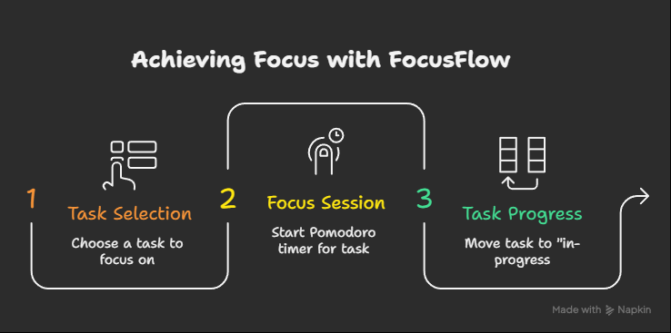
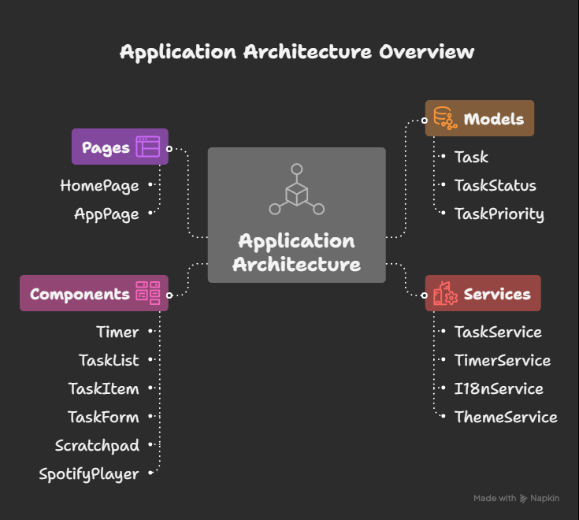
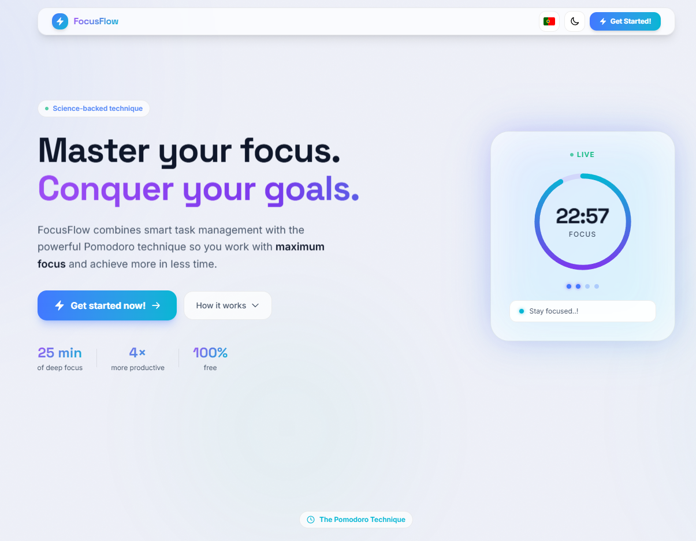
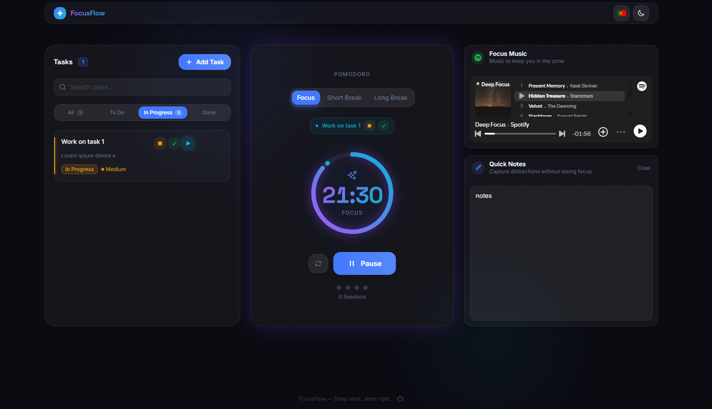
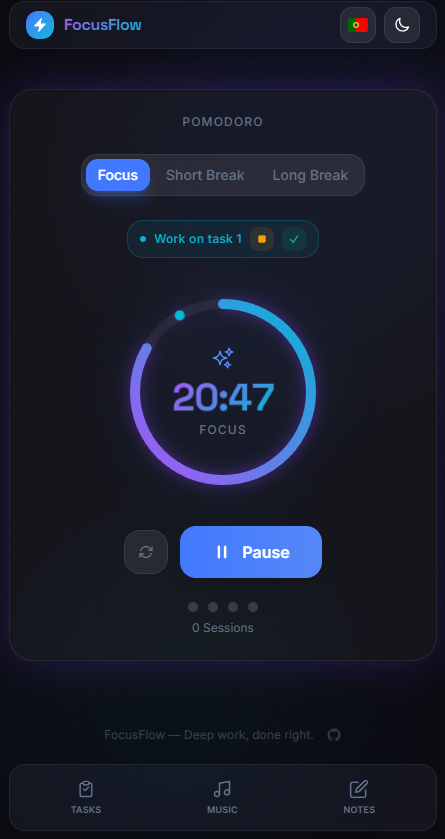

# FocusFlow

A task management + Pomodoro focus timer app built as a frontend technical challenge.

## Overview

FocusFlow combines a Kanban-style task board with a Pomodoro timer so you can manage what needs to get done and stay focused while doing it. Start a focus session directly from any task — the timer launches, the task moves to *in-progress*, and its name appears above the countdown ring so you always know what you're working on.




## Features

- **Task management** — Create, edit, and delete tasks with title, description, priority (high / medium / low), and status (todo / in-progress / done)
- **Pomodoro timer** — Focus (25 min), short break (5 min), and long break (15 min) modes with an animated SVG progress ring
- **Task → Timer link** — Play button on each task starts the Pomodoro immediately, sets that task as *in-progress*, and displays its name above the timer. Only one task can be in-progress at a time
- **Session tracking** — Dot indicators track completed focus sessions (4 per cycle)
- **Scratchpad** — Quick inline notes panel for thoughts during a session
- **Dark / light mode** — Toggles via a CSS variable cascade; dark-first design
- **Bilingual UI** — English and Portuguese (PT) via a built-in i18n service
- **Persistent state** — Tasks saved to `localStorage` across sessions
- **Browser notifications** — Alerts when a focus or break session ends

## Stack


| Layer     | Choice                                      |
|-----------|---------------------------------------------|
| Framework | Angular 21 (standalone components, signals) |
| Styling   | Tailwind CSS v4 (`@tailwindcss/postcss`)    |
| Language  | TypeScript (strict)                         |
| State     | Angular signals + `localStorage`            |

## Architecture


```
src/app/
├── models/
│   └── task.model.ts          # Task, TaskStatus, TaskPriority types
├── services/
│   ├── task.service.ts        # CRUD, filters, localStorage persistence
│   ├── timer.service.ts       # Pomodoro logic, active task tracking
│   ├── i18n.service.ts        # EN / PT translations
│   └── theme.service.ts       # Dark mode toggle
├── components/
│   ├── timer/                 # SVG ring timer + mode tabs + controls
│   ├── task-list/             # Filter tabs, empty state, task grid
│   ├── task-item/             # Task card with play/edit/delete actions
│   ├── task-form/             # Create / edit modal
│   ├── scratchpad/            # Quick notes panel
│   └── spotify-player/        # Embedded player widget
└── pages/
    ├── home/                  # Landing / marketing page
    └── app-page/              # Main two-column app layout
```

## Getting started

```bash
# Install dependencies
npm install

# Start dev server
ng serve
# → http://localhost:4200

# Production build
ng build

# Run tests
ng test
```

## Design notes

- **Color palette** — Purple (`#7c3aed`) + Cyan (`#06b6d4`) accents on a dark base
- **Typography** — Space Grotesk for headings, system sans for body
- **Glassmorphism** — Cards use translucent backgrounds + backdrop blur
- **Animations** — SVG ring progress with cubic-bezier easing, fade-up entry animations, ping pulse on active task button





